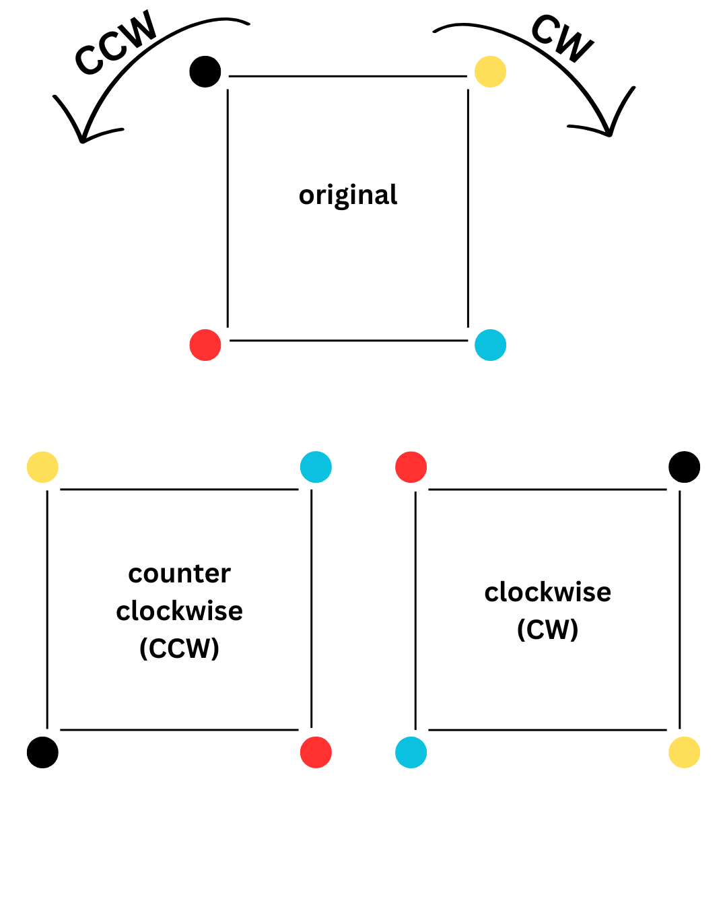

# Square Formation Robot Coordination

This project implements a multi-robot coordination system where four robots are arranged in a square formation. Upon receiving a Clockwise (CW) or Counter-Clockwise (CCW) command, the robots swap positions with their neighbors while preserving the orientation of the robot that previously occupied the target corner.



> In the image above, each colored circle represents a robot at its assigned corner.
> The top diagram shows the initial positions of the four robots, while the bottom-left and bottom-right diagrams illustrate their new positions** after receiving CW and CCW movement commands, respectively.
> Each robot moves to its neighboring corner according to the requested direction, preserving the square formation throughout the maneuver.
> Note: Each robot must adopt the orientation of the robot that previously occupied its new corne at the end of the movement.

---

## ROS Implementation

###  Package: `simulation`

This package includes a **launch file** that opens **Gazebo** using the empty world from the **turtlebot3_simulations** package.
It then spawns **four TurtleBot Burger robots** via the Gazebo spawn service.

The user provides:

* **Square side length**
* **X and Y coordinates of the square’s center**

Using these parameters, the system calculates the initial positions of each robot and spawns them at the corresponding corners.

The launch file also sets up the [TF tree]:

```
world frame → map frame → robot-odom frame
```

This step is not really required for the simulation, but it make sure the (TF structure) matches the configuration used in the real-world setup especially for later lab sessions during offline class.

Additionally, the package launches RViz with a predefined configuration to visualize the robot formation.

---

## Package: `multirobot_interface`

This package provides a custom action that allows each robot to move to its designated corner based on the movement command.

### Action Definition: `MoveToCorner.action`

* **Goal:**

  * `nav_msgs/Odometry target_pose` → the **odometry** of the **neighboring robot’s corner**.

* **Result:**

  * `bool success` → Confirms that the robot hass sucessfully completed the movement

* **Feedback:**

  * `float32 remaining_distance` → Indicates the remaining distance to the target (currently not being used yet)

This structure enables straightforward corner-to-corner motion control, making sure that sycronization between robots are kept.

---

## Package: `multirobot_controller`

This package handles coordinated movement control for multiple robots, enabling them to follow a predefined square pattern while maintaining formation.

The package consists of three main components:

### 1. **Move Action Server**

* 
  Receives the target position from the client and subscribes to the robot's odometry topic to obtain its current position.
  It implements a simple controller that moves the robot to the new corner position while maintaining proper alignment.

### 2. **Move Action Client**

* 
  Subscribes to all robots' odometry and movement signal topics.
  Based on the received signal (CW or CCW), it computes the new target position for each robot and sends an odometry message with the updated goal to the corresponding robot.

### 3. **Transform Odometry**

* 
  Transforms the robot’s odometry data from the robot frame to the map frame using predefined TF transformations.
  Although not needed in simulation(since Gazebo handles TF automatically), this node is essential for real-world deployment.

---

## Launch Files

The package includes two main launch files:

### 1. **Simulation Launch File**

* Launches the Action Client and Action Servers for simulation purposes.

### 2. **Real-World Launch File**

* Launches the Action Client and Servers, and handles odometry transformation between robots and the map frame.

---

## Launch File Arguments

Each launch file accepts the following arguments:

| Argument             | Description                            |
| -------------------- | -------------------------------------- |
| `kp`                 | Proportional gain for the control loop |
| `max_linear_speed`   | Maximum linear speed of the robots     |
| `max_angular_speed`  | Maximum angular speed of the robots    |
| `robots_namespace`   | Namespace assigned to each robot       |
| `square_side_length` | Side length of the square formation    |

---

